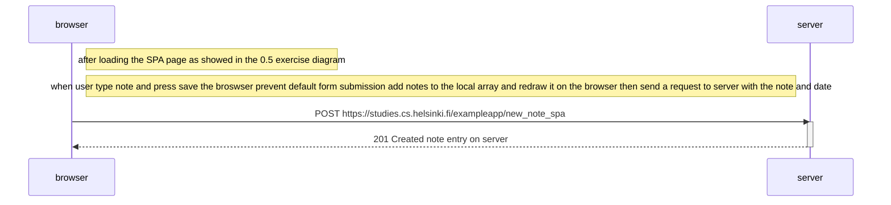

```mermaid
    sequenceDiagram
        participant browser
        participant server

         Note right of browser: after loading the SPA page as showed in the 0.5 exercise diagram
         Note right of browser: when user type note and press save the broswser prevent default form submission add notes to the local array and redraw it on the browser then send a request to server with the note and date 


        browser->>server: POST https://studies.cs.helsinki.fi/exampleapp/new_note_spa
        activate server
        server-->>browser: 201 Created note entry on server 
        deactivate server
```